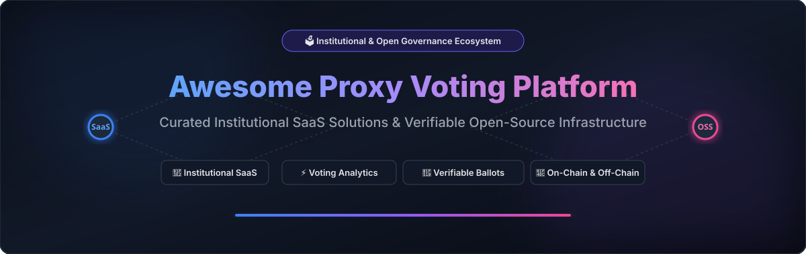

  

# 🗳️ Awesome Proxy Voting Platform Ecosystem

  
  
  
  
  
  
  

> **A curated list of institutional proxy voting SaaS platforms, proxy advisory services, shareholder governance systems, and verifiable open-source voting protocols.**

---

## 📑 Table of Contents

- [📊 Sector Market Overview](#-sector-market-overview)
- [🏢 SaaS & Hosted Platforms](#-saas--hosted-platforms)
- [🔓 Open-Source GitHub Projects](#-open-source-github-projects)
- [🤝 How to Contribute](#-how-to-contribute)
- [📈 Star History](#-star-history)
- [⚠️ Disclaimer](#%EF%B8%8F-disclaimer)

---

## 📊 Sector Market Overview

> **Market Size & Sector Concentration:** The global institutional proxy voting and shareholder governance software market is estimated at **~$3.2 Billion annually**, driven by mandatory SEC compliance (SEC Rule 14a-13, Rule 206(4)-6, EU SRD II) and fiduciary stewardship mandates. The commercial sector is **highly concentrated (oligopolistic / winner-take-most)**—dominated by financial market intermediaries (Broadridge processes over 80% of North American shareholder proxy materials) and a proxy advisor duopoly (ISS & Glass Lewis), while verifiable open-source protocols provide transparent, audit-ready alternatives for decentralized organizations and modern governance workflows.

---

## 🏢 SaaS & Hosted Platforms

The table below lists institutional SaaS proxy voting, advisory, distribution, and governance platforms, **sorted by Company Size (Revenue / Valuation) in descending order**.

| Product / Platform | Company Size (Revenue / Valuation) | Description | Starting Pricing | Free Tier / Free Trial Limit |
| :--- | :--- | :--- | :--- | :--- |
| **Broadridge ProxyEdge** | **~$6.5 Billion Revenue** ($24B+ Market Cap) | Institutional proxy voting platform supporting electronic ballot processing, vote execution, governance workflows, reporting, and custodian connectivity. | Starting at ~$10,000 / year for base institutional subscription tier (or SEC/NYSE baseline per-account fees starting at $0.50/account). | Free policy & voting data access (PPI) for non-profits/academics; 30-day sandbox/demo trial upon request. |
| **Broadridge Proxy Services** | **~$6.5 Billion Revenue** (Broadridge Parent) | Proxy processing and investor communications infrastructure supporting meeting notices, proxy materials, voting instructions, tabulation, and shareholder communications. | Regulated starting rate of $250 base fee per meeting + $0.40–$0.50 per shareholder position for material distribution. | Free E-Proxy electronic notice delivery portal for shareholders; 30-day corporate meeting distribution demo upon request. |
| **Broadridge Issuer Solutions** | **~$6.5 Billion Revenue** (Broadridge Parent) | Issuer-facing technology and communications services supporting shareholder meetings, proxy distribution, voting infrastructure, and investor engagement. | Baseline minimum fee starting at $250 per meeting + $0.40–$0.50 per position for digital proxy distribution. | Free electronic proxy delivery portal for retail shareholders; 30-day corporate issuer demo trial upon request. |
| **Computershare Proxy Services** | **~$3.3 Billion Revenue** ($15B+ Market Cap) | Shareholder-services and issuer-services platform supporting annual and special meetings, proxy distribution, voting, meeting administration, and shareholder records. | Starting at ~$2,500 per meeting for base shareholder meeting administration and proxy processing (or $1,500 setup + $0.50 per account). | Free Investor Centre web portal access for retail shareholders to cast votes; 30-day issuer meeting workflow demo upon request. |
| **Computershare Meeting Services** | **~$3.3 Billion Revenue** (Computershare Parent) | Corporate meeting and shareholder-voting services supporting physical, virtual, and hybrid shareholder meeting workflows. | Starting at ~$2,500 per virtual/hybrid shareholder meeting platform setup. | Free retail shareholder meeting access & live voting portal; 30-day virtual meeting platform demo upon request. |
| **Proxy Insight** | **~$600 Million Parent Revenue** ($25M Division) | Institutional governance and proxy-voting intelligence platform providing voting data, shareholder voting analysis, governance research, and stewardship insights. | Starting at ~$8,000 / year for base stewardship intelligence module (part of Diligent Market Intelligence). | Free executive voting summary reports and annual proxy season previews; 14-day full platform demo upon request. |
| **Institutional Shareholder Services (ISS)** | **~$380 Million Revenue** ($2.3B Valuation) | Major proxy advisory and governance services provider offering institutional voting research, policy-based recommendations, governance analytics, and voting workflows. | Starting at ~$10,000 / year for basic institutional proxy research subscription (or $500 per custom proxy research report). | Free Issuer Data Verification Portal access for public companies to audit corporate governance profiles; 14-day institutional trial upon request. |
| **ISS Governance Solutions** | **~$380 Million Revenue** (ISS Parent) | Governance technology and advisory services covering proxy research, voting policy analysis, stewardship reporting, ESG governance, and investor workflows. | Starting at ~$12,000 / year for basic ESG governance and stewardship reporting module. | Free Corporate Governance Score data verification preview for issuers; 14-day demo access upon sales request. |
| **ProxyExchange** | **~$380 Million Revenue** (ISS Parent) | Proxy voting and governance workflow platform focused on institutional investor voting operations and management of proxy-related information. | Starting at ~$10,000 / year for base institutional vote execution and workflow license. | 14-day institutional sandbox/demo trial with sample ballot workflow upon request. |
| **EQS Group** | **~$85 Million Revenue** ($430M Acquisition) | Governance and compliance technology provider with investor-relations, corporate communications, and shareholder-engagement capabilities. | Starting at ~$2,500 / year ($200 / month) for base IR Cockpit subscription. | 14-day free trial / interactive product demo upon request. |
| **Glass Lewis Viewpoint** | **~$80 Million Revenue** (~$350M Valuation) | Institutional governance research and proxy-voting platform combining meeting research, vote recommendations, policy management, ballot review, and voting workflows. | Starting at ~$12,000 / year for entry-level institutional research & voting access (or $150 per individual issuer research report). | Free Issuer Data Report (IDR) verification preview for public companies; 14-day institutional demo trial upon request. |
| **Glass Lewis** | **~$80 Million Revenue** (~$350M Valuation) | Proxy research and corporate governance intelligence provider offering analysis and voting recommendations for institutional investors. | Starting at ~$12,000 / year for standard institutional meeting coverage & policy analysis. | Free Issuer Data Report (IDR) preview for public companies; 14-day sample research access upon request. |
| **Equiniti Shareholder Services** | **~$70 Million Revenue** ($900M Parent Valuation) | Corporate and shareholder-services provider supporting proxy administration, voting processes, investor communications, meeting services, and share registry operations. | Starting at ~$3,000 per meeting baseline / ~$5,000 per year for standard issuer proxy administration. | Free EQ Shareowner Online portal access for individual shareholders; 30-day demo trial for corporate issuers upon request. |
| **Georgeson** | **~$50 Million Revenue** (Computershare Division) | Shareholder-services and corporate-governance advisory provider supporting proxy solicitation, shareholder engagement, voting campaigns, and meeting communications. | Retainer starting at ~$5,000 per proxy solicitation campaign / meeting. | Free preliminary shareholder list analysis and vote feasibility preview; 30-day campaign planning consultation. |
| **Morrow Sodali** | **~$45 Million Revenue** (TPG Backed) | Corporate governance and shareholder advisory firm supporting proxy solicitation, shareholder engagement, activism preparedness, and voting campaigns. | Retainer starting at ~$7,500 per proxy solicitation campaign / governance mandate. | Free initial proxy contest risk assessment report; corporate advisory consultation demo upon request. |
| **Alliance Advisors** | **~$25 Million Revenue** | Proxy solicitation and shareholder communications provider supporting corporate voting campaigns and investor engagement. | Starting at ~$4,000 per meeting campaign for basic proxy solicitation services. | Free preliminary vote projection report & institutional shareholder profiling preview. |
| **ProxyVote** | **~$15 Million Unit Revenue** (Broadridge Powered) | Electronic shareholder voting platform used for distribution of proxy materials and submission of voting instructions for corporate meetings. | $0 for retail investors (Free for individual shareholders); for corporate issuers, NYSE baseline fee starts at $0.40–$0.50 per position (min $250 per meeting). | Free forever for all retail shareholders to cast unlimited proxy votes using 16-digit control numbers. |
| **Manifest** | **~$5 Million Revenue** | Proxy voting and corporate governance platform providing meeting information, governance analysis, voting services, policy support, and stewardship workflows. | Starting at ~$5,000 (£4,000) / year for base institutional voting portal subscription. | Free public corporate governance summaries & academic dataset previews; 14-day institutional trial upon request. |
| **VoteTracker** | **~$3 Million Revenue** | Voting and election-management platform providing digital ballot administration, vote collection, reporting, and election workflow support. | Starting at $150 per election (or $500 / year for small organization voting subscription). | Free trial up to 1 election / 25 voters or 14-day full feature trial. |
| **OpaVote** | **~$750,000 Revenue** | Online voting service supporting preferential, proportional, and ranked-choice voting methods for elections and polls. | Starting at $10 per election (covers up to 125 voters or 20 candidates). | Free forever plan for up to 25 voters, 10 candidates, and 3 simultaneous elections per account. |

---

## 🔓 Open-Source GitHub Projects

The table below lists open-source proxy voting frameworks, cryptographic election protocol engines, liquid democracy tools, and DAO governance infrastructure, **sorted by GitHub Star Count in descending order**.

| Repository / Project | Stars Badge | Description |
| :--- | :--- | :--- |
| **[OpenZeppelin Contracts](https://github.com/OpenZeppelin/openzeppelin-contracts)** |  | Modular open-source smart-contract library containing production-grade `Governor` primitives, token delegation modules (`ERC20Votes`), timelocks, and counting mechanisms for governance. |
| **[Snapshot](https://github.com/snapshot-labs/snapshot-v1)** |  | Major open-source off-chain governance and voting platform supporting gasless proposal voting, weighted strategies, multi-choice ballots, and verifiable cryptographic voting records. |
| **[Loomio](https://github.com/loomio/loomio)** |  | Open-source collaborative decision-making platform supporting discussions, formal proposals, group consensus voting, and organizational governance. |
| **[Compound Governance](https://github.com/compound-finance/compound-protocol)** |  | Industry-standard on-chain governance architecture implementing proposal creation, delegated voting power, quorum checks, and timelocked execution. |
| **[Decidim](https://github.com/decidim/decidim)** |  | Large participatory democracy platform supporting civic consultations, proposals, secure digital voting processes, and transparent decision tracking. |
| **[DemocracyOS](https://github.com/DemocracyOS/democracyos)** |  | Open-source digital democracy platform designed for decision-making, proposal deliberation, liquid proxy delegation, and direct voting. |
| **[Consul Democracy](https://github.com/consuldemocracy/consuldemocracy)** |  | Open-source citizen participation platform supporting participatory budgeting, proposal voting, debates, and voting administration. |
| **[Pol.is](https://github.com/compdemocracy/polis)** |  | Open-source opinion-gathering and consensus-analysis system utilizing machine learning to analyze large-scale stakeholder sentiment and governance proposals. |
| **[Helios Voting](https://github.com/benadida/helios-server)** |  | Open-source end-to-end verifiable cryptographic election server enabling web-based elections with complete voter privacy and public auditability. |
| **[ElectionGuard](https://github.com/Election-Tech-Initiative/electionguard)** |  | Open-source cryptographic election software development kit enabling end-to-end verifiable elections and independently auditable vote tabulation. |
| **[Nouns Builder](https://github.com/nounsDAO/nouns-monorepo)** |  | Open-source governance infrastructure enabling custom tokenized membership, proposal creation, treasury execution, and voting power delegation. |
| **[Moloch DAO](https://github.com/MolochVentures/moloch)** |  | Minimalist open-source governance framework implementing membership-based voting, proposal processing, ragequit protection, and treasury governance. |
| **[Colony Network](https://github.com/JoinColony/colonyNetwork)** |  | Modular open-source governance protocol supporting domain-based authority, reputation-weighted voting, and automated financial management. |
| **[Snapshot Strategies](https://github.com/snapshot-labs/snapshot-strategies)** |  | Open-source JavaScript repository of modular voting strategies for calculating voter eligibility, token weightings, and custom snapshot delegation. |
| **[gov4git](https://github.com/gov4git/gov4git)** |  | Open-source decentralized governance protocol for Git repositories enabling cryptographically signed proposals, voting, and maintainer delegation. |
| **[Aragon OSx](https://github.com/aragon/osx)** |  | Modular open-source governance architecture providing secure permission management, custom voting plugins, and proposal lifecycles. |
| **[Vocdoni Node](https://github.com/vocdoni/vocdoni-node)** |  | Open-source decentralized voting infrastructure focusing on zero-knowledge privacy, verifiable cryptographic ballots, and scalable digital elections. |
| **[DAOstack Arc](https://github.com/daostack/arc)** |  | Modular smart-contract framework implementing Holographic Consensus, reputation-weighted voting, and scaled decision-making for organizations. |

---

## 🤝 How to Contribute

Contributions are welcome! Please follow these simple steps:

1. Fork the repository.
2. Add or update entries in `README.md` adhering to the tabular structure.
3. Ensure entries include verifiable pricing, company revenue/size estimates, and star badges for open-source repositories.
4. Submit a Pull Request with a short summary of changes.

For curated lists guidelines, see [Awesome-Awesome-Awesome](https://github.com/ishandutta2007/Awesome-Awesome-Awesome).

---

## 📈 Star History

---

## ⚠️ Disclaimer

- This repository is a community-curated reference list for educational and technical informational purposes—not an endorsement or legal proxy advisory.
- Institutional proxy voting and beneficial ownership processing are governed by financial market regulations (SEC, FINRA, NYSE, EU SRD II).
- Self-hosted voting platforms and cryptographic election tools require independent security audits, voter identity verification, and legal review before deployment in regulated corporate governance environments.

